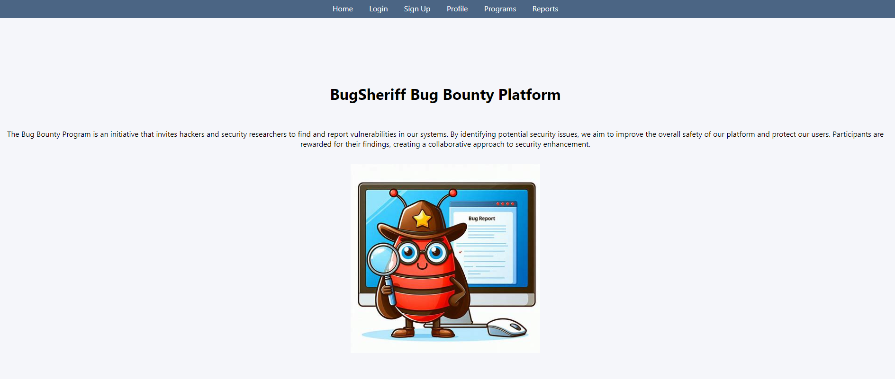

# BugSheriff Bug Bounty Platform

## Project Description
This project is a bug bounty platform where users can report security vulnerabilities and earn rewards. Admin users can manage programs, add new programs, and review user reports.

## Features
- User and admin logins
- Program listing, adding, deleting, and updating
- User report management
- JWT authentication
- User-friendly web interface

## Requirements
- C#
- Docker
- PostgreSQL
- Flask

## Running the Project

### Run Docker
1. Navigate to the project directory:
   ```bash
   cd Docker-psql-flask
   ```

2. Run the Docker Compose command:
   ```bash
   docker-compose up --build
   ```

**Note:** You can refer to the Docker-psql-flask/README.md file for an example database insertion query.

### Run .NET Web
1. Navigate to the project directory:
   ```bash
   cd BugSheriff
   ```

2. Open the solution (BugSheriff.sln) in Visual Studio.

3. Start the project.


## Final Notes
   - Change the Flask API URL in the C# project to your database IP address.

- To stop and remove containers:
   ```bash
   docker-compose down 
   ```

- To remove volumes:
   ```bash
   docker volume rm docker-psql-flask_postgres_data

   docker volume rm docker-psql-flask_uploads
   ```


## Home Page



